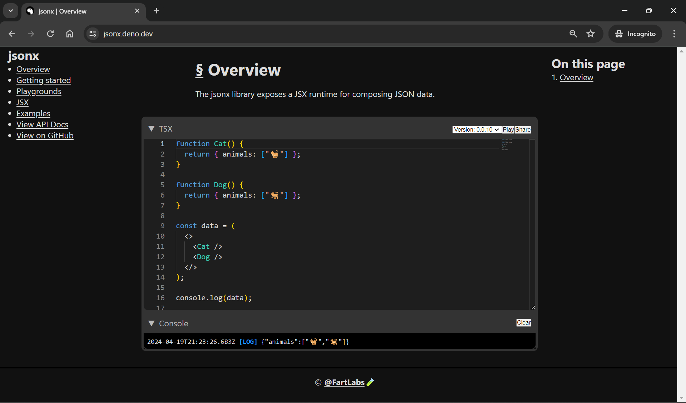

# jsonx_docs

Documentation site for the [`jsonx`](https://github.com/FartLabs/jsonx) project
— a JSX runtime for composing JSON data. This repo contains the source for the
public docs available at `https://jsonx.fart.tools/`.

[](https://jsonx.fart.tools/)
[](https://github.com/FartLabs/jsonx_docs/issues)
[](https://github.com/FartLabs/jsonx_docs/pulls)

[](https://jsonx.fart.tools/)

## Getting Started

### Prerequisites

- [Deno](https://deno.land/)

### Installation

```bash
git clone https://github.com/FartLabs/jsonx_docs.git
cd jsonx_docs
```

### Local development

```bash
deno task dev
```

This starts a local dev server and watches files for changes.

### Build for production

```bash
deno task build
```

### Preview the production build

```bash
deno task preview
```

## Examples

In the docs, you'll find:

- Introduction to `jsonx` and its goals
- Quick start and basic usage patterns
- Authoring JSON via JSX with `jsonx`
- Common recipes and examples
- Links to API references and deeper guides in the main `jsonx` repo

> For the most up‑to‑date navigation and topics, see the sidebar on the live
> docs at `https://jsonx.fart.tools/`.

## Development

- Format code:
  ```bash
  deno fmt
  ```
- Lint code:
  ```bash
  deno lint
  ```
- Start local server:
  ```bash
  deno task dev
  ```
- Build production assets:
  ```bash
  deno task build
  ```
- Preview production build locally:
  ```bash
  deno task preview
  ```
- Update dependencies:
  ```bash
  deno task update
  ```

### Create a new documentation page

Add a new markdown file under the `docs` directory using the numeric prefix
scheme `NN_title.md` (e.g., `01_getting_started.md`). Sections may also live in
subdirectories with their own `00_index.md` (see existing folders like
`02_playgrounds/`, `03_concepts/`, `97_examples/`).

Frontmatter fields used by existing pages are:

```yaml
title: Title of the page # required
playground: example:01_animals.tsx # optional; used to power playground UIs
```

Slug and ordering guidelines:

- Filenames use a numeric prefix `##_` for ordering, e.g.,
  `01_getting_started.md`.
- The numeric prefix is stripped from the URL slug. In the example above, the
  slug becomes `getting_started`.
- The numeric prefix is used only for deterministic ordering within its
  directory; it is not part of the slug or displayed title.
- Section index files named `00_index.md` represent the base route of their
  directory (e.g., `03_concepts/00_index.md` maps to the `concepts` section
  root) and are ordered first in that section.

## Testing

This repo does not currently include automated tests. Use `deno fmt` and
`deno lint` as part of your validation before submitting changes.

## Documentation Structure

High-level areas commonly covered in the docs include:

- Overview and motivation
- Getting started walkthrough
- Examples and recipes
- References to core `jsonx` concepts and APIs

## Contribute

Issues and pull requests are welcome! Please follow the style guidelines below
when contributing.

### Style

- Run `deno fmt` to format the code.
- Run `deno lint` to lint the code.
- Run `deno task dev` to locally serve the jsonx documentation site.
- Run `deno task build` to build for production and `deno task preview` to
  preview.
- Run `deno task update` to update dependencies.
- Run `deno task precommit` before opening a PR.

## License

This documentation site follows the licensing of the repository. See the
[LICENSE](./LICENSE) file. For the `jsonx` project license, refer to the main
[`jsonx` repository](https://github.com/FartLabs/jsonx).

---

Developed with ❤️ [**@FartLabs**](https://github.com/FartLabs)
